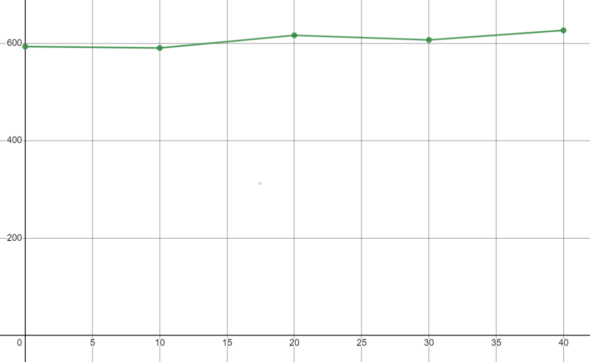
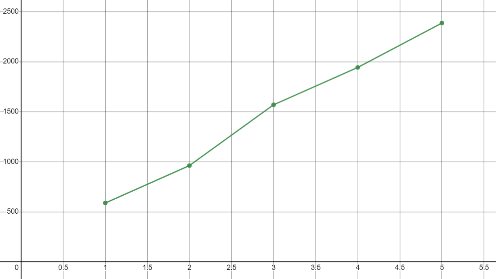
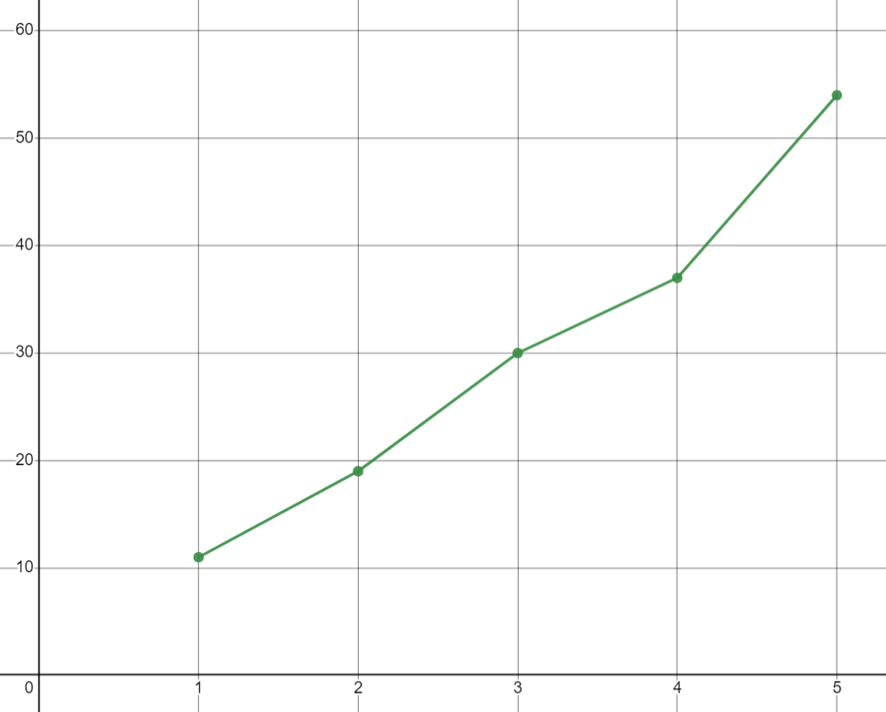
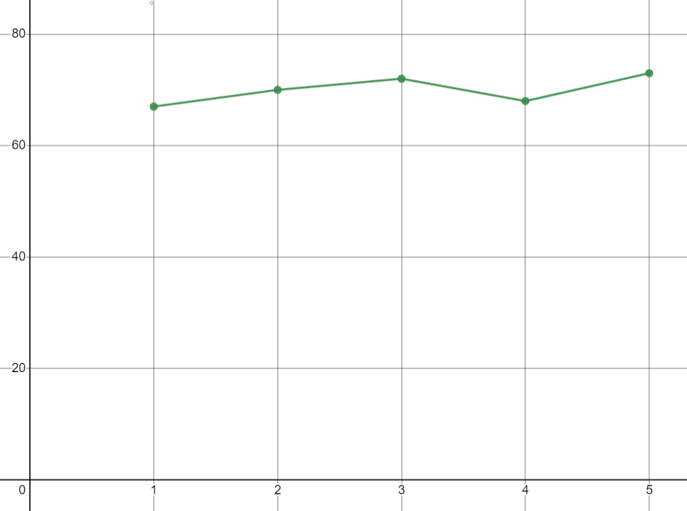
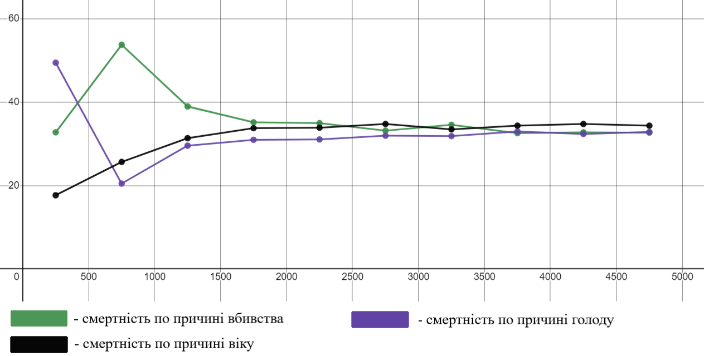

## Імітаційне моделювання комп'ютерних систем
## СПм-21-2, **Скляров Артем Сергійович**
### Лабораторна робота №**1**. Опис імітаційних моделей

 

### Обрана модель в середовищі NetLogo:
[Fruit Wars](http://www.netlogoweb.org/launch#http://www.netlogoweb.org/assets/modelslib/Sample%20Models/Social%20Science/Economics/Fruit%20Wars.nlogo)

 

### Вербальний опис моделі:
Симуляція економічного середовища з ненульовою сумою, в якому здобувачі їжі блукають по карті в пошуках плодових чагарників. Коли вони прибувають до плодового куща, вони отримують енергію шляхом збору їжі, доки плодовий кущ не вичерпає ресурси. Ці здобувачі розмножуються та передають свої характеристики нащадкам після збору певної кількості енергії. Вони також приймають рішення на основі спадкових параметрів щодо того, як взаємодіяти з іншими здобувачами, які збирають їжу. Здобувачі їжі можуть співпрацювати, погрожувати, воювати чи тікати за різних обставин.

### Керуючі параметри:
- **initial-fruit-bushes** визначає початкову кількість плодових кущів на карті.
- **initial-foragers** визначає початкову кількість здобувачів їжі на карті.
- **show-energy?** визначає чи потрібно відображати поточну енергію кожного окремого здобувача їжі на карті.
- **visualization** визначає колір здобувачів їжі на карті. Колір залежить від вибору на основі значення цього параметру, при цьому більш світлі кольори представляють більше значення.
- **ticks-to-flee** визначає кількість тактів, перш ніж здобувач їжі зможе шукати новий плодовий кущ у випадку, коли він тікає.
- **rate-of-mutation** визначає ймовірність зміни окремого біта в геномі нащадка.
- **collaboration-bonus** визначає коефіцієнт, який використовується для визначення рівня спільного збирання їжі. Вищий бонус за співпрацю означає вищі показники збирання їжі кількома здобувачами на одному кущі.
- **max-age** визначає максимальну кількість тактів, яку може прожити окремий здобувач їжі.
- **bush-growth-chance** визначає ймовірність того, що виросте новий плодовий кущ на кожному такті.

### Внутрішні параметри:
- **energy**. Метаболічна енергія здобувача їжі. Може відрізнятися у кожного здобувача в різні моменти модельного часу.
- **genome**. Список спадкових параметрів в закодованому вигляді.
- **foraging?**. Булевий параметр, що визначає чи збирає здобувач їжу з плодового куща в даний момент. Може відрізнятися у кожного здобувача в різні моменти модельного часу.
- **fleeing?**. Булевий параметр, що визначає чи тікає здобувач їжі в даний момент. Може відрізнятися у кожного здобувача в різні моменти модельного часу.
- **fleeing-turns**. Кількість тактів, що залишилися, для втечі, якщо здобувач їжі тікає. Може відрізнятися у кожного здобувача в різні моменти модельного часу.
- **age**. Вік здобувача їжі у тактах. Може відрізнятися у кожного здобувача в різні моменти модельного часу.
- **speed**. Швидкість руху здобувача їжі.
- **strength**. Сила здобувача їжі. Впливає на результат бою.
- **intelligence**. Інтелект здобувача їжі. Впливає на групову швидкість збирання їжі.
- **reactive-aggression**. Ймовірність того, що здобувач їжі почне погрожувати іншим після прибуття до плодового куща.
- **proactive-aggression**. Ймовірність того, що здобувач їжі почне захищатися після появи загрози для нього.

### Критерії ефективності системи:
- поточна смертність по причині вбивства.
- поточна смертність по причині голоду.
- поточна смертність по причині віку.
- середній розмір популяції.
- кількість тактів, яку змогла протриматися популяція здобувачів їжі.
- доля здобувачів, що збирають їжу, на один такт.

### Алгоритм роботи моделі:

**Здобувачі корму** в моделі мають 240-бітні бінарні геноми:
- сума перших 120 біт визначає **strength**, **speed** і **intelligence** здобувачів їжі. Ці три атрибути можуть мати будь-які значення від 0 до 60, але їхня сума завжди повинна бути 60.
- сума бітів від 120 до 180 визначає **reactive-aggression** здобувача їжі, яка визначає схильність загрожувати, коли він наближається до куща, і тенденцію до загрози новоприбулим, коли він уже біля куща. Сума бітів від 180 до 240 визначає **proactive-aggression** здобувача їжі, яка визначає схильність давати відсіч у разі загрози.

**Кожен такт у моделі**:
- Для кожного здобувача їжі:
  - якщо поблизу немає кущів або встановлений статус **fleeing**, рухатися випадково на основі атрибута **speed**. Спожити 1 енергію.
  - якщо поруч є кущ, рухатися до нього на відстань, що залежить від атрибута **speed**. Спожити 1 енергію.
  - якщо кущ дуже близько, виконати **процедуру прибуття**.
  - якщо встановлений статус – **foraging**, набрати енергії та забрати цю енергію з куща. Якщо у куща закінчується енергія, прибрати кущ та позбавити статусу **foraging** всіх інших здобувачів у цьому кущі.
  - якщо енергія вище 200, виконати процедуру розмноження, спожити 100 енергії.
  - якщо енергія вичерпана або вік більше максимального, померти.

- Процедура прибуття:
  - якщо на плодовому кущі немає інших здобувачів, встановити статус на **foraging**.
  - якщо біля куща є інші здобувачі, прибулий здобувач вирішує погрожувати або співпрацювати, виходячи з його значення **reactive-aggression**.
  - якщо прибулий здобувач обрав погрожувати, інші здобувачі в кущі вирішують втекти або дати відсіч відповідно до свого параметра **proactive-aggression**.
    - якщо хтось дає відсіч, той, хто прибуває, перемагає з ймовірністю, яка базується на різниці між силою прибулого здобувача та сукупною силою всіх інших здобувачів, які вирішили дати відсіч. Якщо прибулий здобувач перемагає, усі здобувачі, які вирішили дати відсіч, гинуть, інакше прибулий здобувач гине.
    - якщо всі інші здобувачі тікають, прибулий здобувач встановлює свій статус на **foraging**.
  - якщо прибулий здобувач вирішує співпрацювати, і є ще один присутній здобувач, цей здобувач вирішує або дозволити прибулому здобувачу приєднатися, або погрожувати, змусивши прибулого здобувача втекти.
    - якщо всі присутні здобувачі не загрожують, статус прибулого здобувача встановлюється на **foraging**.

- Процедура розмноження:
  - кожен здобувач має бінарний геном, який кодує значення його параметрів. Коли здобувачі розмножуються (безстатевим шляхом), геном передається нащадкам, і кожна позиція в геномі має шанс змінити значення. Цей шанс визначається параметром **rate-of-mutation**.

### Примітки:
- якщо на карті не залишається жодного здобувача їжі або вся карта заповнюється плодовими кущами, то симуляція завершується помилкою.
- іноді деякі початкові здобувачі їжі стоять на місці і не переміщуються на карті. Це може призвести до складнощів, якщо необхідно створити симуляцію з малою початковою кількістю здобувачів.
- максимальний вік здобувачів краще не змінювати під час ввімкненої симуляції тому, що в момент редагування, значення віку може бути надто малим, і в цей момент всі здобувачі їжі можуть вимерти.

### Недоліки моделі:
- після того, як ресурси плодового куща закінчуються, група здобувачів прив'язана до цього куща, завжди розформовується, хоча було б логічніше, якщо з деякою ймовірністю, вони продовжували б шукати новий кущ цією ж групою або формували б декілька груп менших розмірів.
- обмеження на деяких параметрах системи, таких як **rate-of-mutation** або **collaboration-bonus** не дають повною мірою провести експерименти, зав'язані на цих параметрах.
- після кожного бою, одна із сторін, що приймала участь в ньому, завжди вмирає, хоча було б логічніше, щоб з деякою ймовірністю вона могла вижити, але наприклад втратити частину ресурсів.

 

## Обчислювальні експерименти

### 1. Початкова кількість плодових кущів не впливає на середній розмір популяції при умовах, в яких популяція здатна виживати достатньо довго.
Досліджуємо залежність середнього розміру популяції від початкової кількості плодових кущів, в умовах коли параметри симуляції дозволяють популяції виживати достатньо довго (більше 5000 тактів). Експерименти проводилися з початковою кількістю плодових кущів від 0 до 40, з кроком 10, всього 5 симуляцій.
Параметри системи, при яких здійснювалась симуляція:
- **initial-foragers**: 100
- **ticks-to-flee**: 50
- **rate-of-mutation**: 5
- **collaboration-bonus**: 40
- **max-age**: 250
- **bush-growth-chance**: 50

<table>
<thead>
<tr><th>Початкова кількість плодових кущів</th><th>Середній розмір популяції</th></tr>
</thead>
<tbody>
<tr><td>0</td><td>593.5</td></tr>
<tr><td>10</td><td>590.5</td></tr>
<tr><td>20</td><td>616.6</td></tr>
<tr><td>30</td><td>607.1</td></tr>
<tr><td>40</td><td>626.7</td></tr>
</tbody>
</table>

Залежність середнього розміру популяції від початкової кількості плодових кущів

Графік наочно показує, що середній розмір популяції не залежить від початкової кількості плодових кущів. Середній розмір популяції становить 610 з похибкою 17.

### 2. Вплив бонусу за співпрацю на середній розмір популяції, долю здобувачів, що збирають їжу, на один такт та смертність по причині вбивства.
Досліджуємо залежність середнього розміру популяції, долі здобувачів, що збирають їжу, на один такт та смертності по причині вбивства від бонусу за співпрацю, в умовах коли здобувачам їжі доступна максимально можлива кількість плодових кущів, а максимальний вік здобувачів їжі є достатньо великим. Експерименти проводилися з бонусом за співпрацю від 1 до 5, з кроком 1, всього 5 симуляцій.
Параметри системи, при яких здійснювалась симуляція:
- **initial-fruit-bushes**: 40
- **initial-foragers**: 40
- **ticks-to-flee**: 50
- **rate-of-mutation**: 1
- **max-age**: 250
- **bush-growth-chance**: 100

<table>
<thead>
<tr><th>Бонус за співпрацю</th><th>Середній розмір популяції</th><th>Доля здобувачів, що збирають їжу, на один такт</th><th>Смертність по причині вбивства</th></tr>
</thead>
<tbody>
<tr><td>1</td><td>588.4</td><td>11</td><td>67</td></tr>
<tr><td>2</td><td>962.7</td><td>19</td><td>70</td></tr>
<tr><td>3</td><td>1570.2</td><td>30</td><td>72</td></tr>
<tr><td>4</td><td>1943.5</td><td>37</td><td>68</td></tr>
<tr><td>5</td><td>2387.1</td><td>54</td><td>73</td></tr>
</tbody>
</table>

Залежність середнього розміру популяції від бонусу за співпрацю

Залежність долі здобувачів, що збирають їжу, на один такт від бонусу за співпрацю

Залежність смертності по причині вбивства від бонусу за співпрацю

Графіки наочно показують, що чим більше бонус за співпрацю, тим більше середній розмір популяції. Разом із розміром популяції збільшується і доля здобувачів, що збирають їжу, але смертність по причині вбивста майже не залежить від бонусу за співпрацю, на графіку видно, що при будь-якому бонусі за співпрацю, смертність становить 70% з похибкою 3%. 

### 3. Підбір значень керуючих параметрів, щоб смертність по всім трьом причинам (вбивство, голод, вік) була однаковою.
Досліджуємо значення параметрів при яких система перейде у стан з однаковою смертністю кожного типу. Експеримент проводився для кількості тактів від 250 до 4750, з кроком 500, всього 1 симуляція.
Параметри системи, при яких через визначену кількість тактів смертність по всім причинам стає однаковою, тобто приблизно 33.3%:
- **initial-fruit-bushes**: 13
- **initial-foragers**: 100
- **ticks-to-flee**: 49
- **rate-of-mutation**: 1
- **collaboration-bonus**: 5
- **max-age**: 149
- **bush-growth-chance**: 20

<table>
<thead>
<tr><th>Кількість тактів</th><th>Смертність по причині вбивства</th><th>Смертність по причині голоду</th><th>Смертність по причині віку</th></tr>
</thead>
<tbody>
<tr><td>250</td><td>32.8</td><td>49.5</td><td>17.7</td></tr>
<tr><td>750</td><td>53.8</td><td>20.5</td><td>25.7</td></tr>
<tr><td>1250</td><td>39</td><td>29.6</td><td>31.4</td></tr>
<tr><td>1750</td><td>35.2</td><td>31</td><td>33.8</td></tr>
<tr><td>2250</td><td>35</td><td>31.1</td><td>33.9</td></tr>
<tr><td>2750</td><td>33.2</td><td>32</td><td>34.8</td></tr>
<tr><td>3250</td><td>34.6</td><td>31.9</td><td>33.5</td></tr>
<tr><td>3750</td><td>32.6</td><td>33</td><td>34.4</td></tr>
<tr><td>4250</td><td>32.8</td><td>32.4</td><td>34.8</td></tr>
<tr><td>4750</td><td>32.7</td><td>32.9</td><td>34.4</td></tr>
</tbody>
</table>

Залежність смертності кожного типу від кількості тактів

 
Графік наочно показує, що при заданих параметрах популяція перейшла в необхідний стан на 2750 такті, а на всіх наступних тактах кожен тип смертності зберігав значення на рівні 33.3% з похибкою 1.5%.
