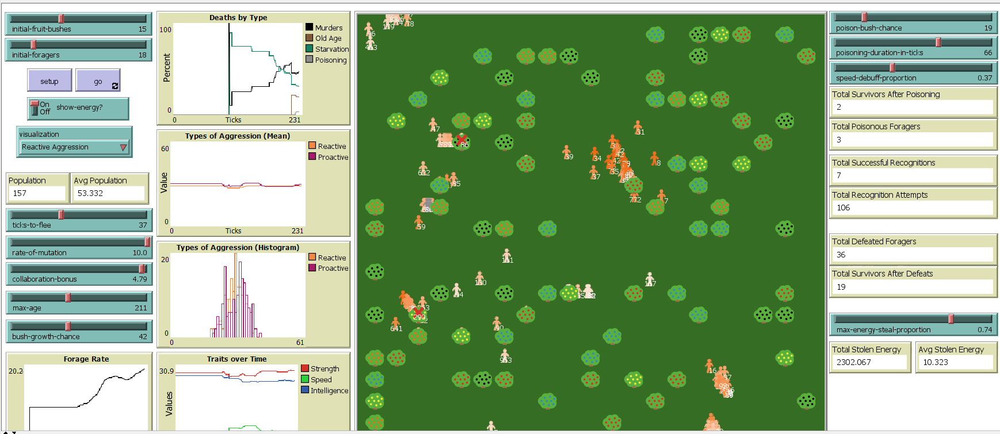
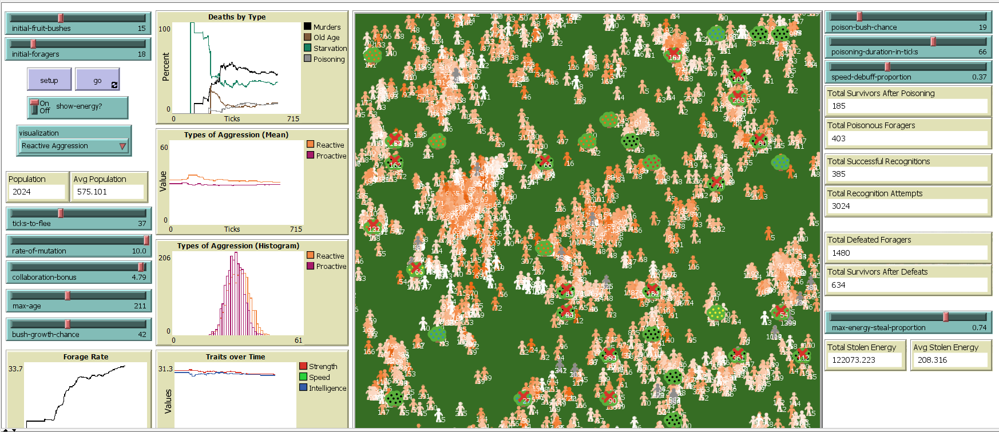
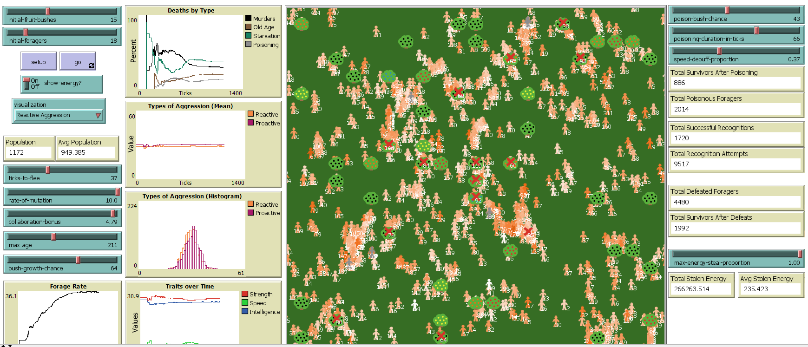

## Імітаційне моделювання комп'ютерних систем
## СПм-21-2, **Скляров Артем Сергійович**
### Лабораторна робота №**2**. Редагування імітаційних моделей в середовищі NetLogo

 

### Обрана модель в середовищі NetLogo:
[Fruit Wars](http://www.netlogoweb.org/launch#http://www.netlogoweb.org/assets/modelslib/Sample%20Models/Social%20Science/Economics/Fruit%20Wars.nlogo)

 

### Вербальний опис моделі:
Доступно у файлі з першої лабораторної роботи [Fruit Wars](../Lab1/ІМКС_ЛБ1.md).

### Внесені зміни до вихідної логіки моделі:

**1. Додавання нового типу кущів - отруйних, а також логіки взаємодії здобувачів їжі з такими кущами.** 
- При генерації куща, з деякою ймовірністю він може стати отруйним. Ймовірність задається користувачем.
- Перед тим, як почати збирати ресурси з куща, здобувач їжі може розпізнати отруйний кущ. Ймовірність розпізнавання залежить від рівня інтелекту здобувача.
- Якщо здобувач їжі розпізнав отруйний кущ, він тікає від нього в пошуках нового куща.
- Якщо здобувач їжі не розпізнав отруйний кущ, він починає збирати ресурси з нього.
- Після завершення збору ресурсів з куща, якщо кущ був отруйний, здобувач або помирає, або виживає (ймовірність виживання залежить від сили здобувача).
- Якщо здобувач їжі вижив після отруєння, він отримує зниження параметра швидкості на деяку кількість тактів (коефіцієнт зниження швидкості та тривалість ефекту задається користувачем).
- Отруйні кущі мають інший колір ягід на мапі.
- На графіку "Deaths By Type" додається новий тип смертності "від отруєння".

Спочатку додаємо нове поле для кожного куща, яке зберігає інформацію про те, отруйний кущ чи ні:
<pre>
fruit-bushes-own
[
  ...
  poisonous? ; boolean status whether bush is poisonous
]
</pre>
Далі додаємо в процедуру генерації кущів наступну логіку:
<pre>
to grow-fruit-bushes [ num-bushes ] ; procedure to create fruit-bushes on a grid without overlap
  ...
  if-else random 100 < poison-bush-chance
  [
    set poisonous? true
    set color black
  ]
  [
    set poisonous? false
    set color one-of [ red sky orange yellow ]
  ]
  ...
end
</pre>
Колір ягід отруйного куща обрано чорний, колір блакитних ягід змінено з blue на sky, тому що колір blue мав темний відтінок і його було важко відрізнити від чорного.

Додаємо нові поля для кожного здобувача їжі:
<pre>
foragers-own
[
  ...
  last-bush-poisonous? ; boolean status whether forager is foraging from poisonous bush
  poisoning-turns ; number of turns remaining to end poisoning
  ...
]
</pre>
Задаємо початкові значення для нових полів здобувача їжі в процедурі setup, при створенні початкової популяції та в процедурі move-foragers, при розмноженні:
<pre>
set last-bush-poisonous? false
set poisoning-turns 0
</pre>
В усіх місцях де раніше було
<pre>
set foraging? true
</pre>
потрібно замінити на виклик нової процедури:
<pre>
to try-start-foraging ; first forager tries to recognize poisonous bush and then start foraging
  set total-recognition-attempts total-recognition-attempts + 1
  let recognize-poison-chance (intelligence / 60)
  if-else random-float 1 < recognize-poison-chance and any? fruit-bushes in-radius 0.1 with [poisonous?]
  [
    set total-successful-recognitions total-successful-recognitions + 1
    set fleeing? true
    set fleeing-turns ticks-to-flee
  ]
  [
    set foraging? true
    if-else any? fruit-bushes in-radius 0.1 with [poisonous?]
    [ set last-bush-poisonous? true ]
    [ set last-bush-poisonous? false ]
  ]
end
</pre>
В процедурі try-start-foraging виконується спроба розпізнати отруйний кущ. У випадку успіху розпізнавання, здобувач їжі починає тікати від нього. У випадку, якщо кущ не вдалося розпізнати або кущ не є отруйним, то ми починаємо збирати з нього ресурси. Також у другому випадку ми запам'ятовуємо в полі last-bush-poisonous інформацію чи отруйний кущ, з якого здобувач збирає ресурси.

Потім в усіх місцях де раніше було
<pre>
set foraging? false
</pre>
потрібно замінити на виклик нової процедури:
<pre>
to try-end-foraging ; if bush is poisonous forager tries survive and then end foraging
  if foraging?
  [
    set foraging? false
    if last-bush-poisonous?
    [
      set total-poisonous-foragers total-poisonous-foragers + 1
      let survive-chance (strength / 60)
      if-else random-float 1 < survive-chance
      [
        set total-survivors-after-poisoning total-survivors-after-poisoning + 1
        set poisoning-turns poisoning-duration-in-ticks
      ]
      [
        set poisoning-death-count poisoning-death-count + 1
        die
      ]
    ]
  ]
end
</pre>
В процедурі try-end-foraging виконується завершення збирання ресурсів з куща. Якщо кущ, з якого збиралися ресурси був отруйним, то здобувач з деякою ймовірністю може вижити та отримати тимчасове зниження швидкості, або померти. Поле poisoning-turns зберігає кількість тактів, яку залишилося діяти ефекту зниження швидкості.

Для того, щоб діяв ефект зниження швидкості потрібно в усіх місцях замінити використання параметру speed на виклик процедури get-actual-speed:
<pre>
to-report get-actual-speed ; forager reporter
  if-else poisoning-turns > 0
  [report speed * (1 - speed-debuff-proportion)]
  [report speed]
end
</pre>
Для того, щоб ефект зниження швидкості з часом припинив свою дію, необхідно додати в процедуру move-foragers наступний код:
<pre>
if poisoning-turns > 0 [set poisoning-turns poisoning-turns - 1]
</pre>
Для додавання нового типу смертності на графік, додано нові глобальні поля:
<pre>
globals
[
  ...
  poisoning-death-count ; total deaths from poisoning
  poisoning-death-rate ; rate of deaths from poisoning to all deaths
  ...
]
</pre>
Додано скидання кількості смертей від отруєння в процедурі setup:
<pre>
set poisoning-death-count 0
</pre>
В процедурі go змінено розрахунок долі смертності кожного типу:
<pre>
let deaths-sum (murder-count + age-death-count + starvation-count + poisoning-death-count)
if-else deaths-sum = 0
[
  set murder-rate 0
  set starvation-rate 0
  set age-death-rate 0
  set poisoning-death-rate 0
]
[
  set murder-rate 100 * murder-count / deaths-sum
  set starvation-rate 100 * starvation-count / deaths-sum
  set age-death-rate 100 * age-death-count / deaths-sum
  set poisoning-death-rate 100 * poisoning-death-count / deaths-sum
]
</pre>
Суму всіх смертей винесено в локальну змінну, а також додано розрахунок долі смертності від отруєння.

Для більшого контролю за системою додано наступні глобальні змінні, що використовуються для спостерігання:
<pre>
globals
[
  ...
  total-poisonous-foragers ; total poisonous foragers in all ticks
  total-survivors-after-poisoning ; total survivors after poisoning in all ticks
  total-recognition-attempts ; total recognition attempts in all ticks
  total-successful-recognitions ; total successful recognitions in all ticks
  ...
]
</pre>

**2. Змінити логіку закінчення битви так, щоб здобувач, що програв, не обов'язково помирав**, а з деякою ймовірністю виживав. Ймовірність залежить від співвідношення параметрів сили сторін, що боролися. У випадку виживання здобувач, що програв починає тікати та шукати інший кущ.
 
Для виконання логіки спроби виживання після поразки в битві, додана процедура try-survive-after-defeat:
<pre>
to try-survive-after-defeat [ survive-chance ] ; if forager have got defeat, he tries survive and then flee
  set total-defeated-foragers total-defeated-foragers + 1
  if-else random-float 1 < survive-chance
  [
    set total-survivors-after-defeats total-survivors-after-defeats + 1
    try-end-foraging
    set fleeing? true
    set fleeing-turns ticks-to-flee
  ]
  [
    set murder-count murder-count + 1
    hatch-deaths 1 [set color red set shape "x" set age 0]
    die
  ]
end
</pre>
Якщо здобувач їжі виживає після поразки, то спочатку викликається процедура try-end-foraging, при виконанні якої здобувач їжі також може загинути, якщо він збирав ресурси з отруйного куща. Виклик цієї процедури потрібен, коли битву програли ті, хто захищалися. Для нападника ця процедура почне виконуватися й одразу завершиться через те, що в нього поле foraging? матиме значення false. Після цього, той хто програв починає тікати. Якщо вижити не вдалося, то здобувач їжі помирає.

Щоб логіка працювала, потрібно код
<pre>
if-else count-fighters > 0
[
  if-else random-float 1 < (strength / ((total-strength * 0.75) + strength))
  [
    set murder-count murder-count + count-fighters
    ask other foragers in-radius 0.1 with [foraging?]
    [
      hatch-deaths 1 [set color red set shape "x" set age 0]
      die
    ]
  ]
  [
    set murder-count murder-count + 1
    hatch-deaths 1 [set color red set shape "x" set age 0]
    die
  ]
]
[
  try-start-foraging
]
</pre>
змінити на
<pre>
if-else count-fighters > 0
[
  if-else random-float 1 < (strength / ((total-strength * 0.75) + strength))
  [
    let enemy-strength strength
    ask other foragers in-radius 0.1 with [foraging?]
    [
      try-survive-after-defeat (strength / (strength + enemy-strength))
    ]
  ]
  [
    try-survive-after-defeat (strength / (strength + total-strength))
  ]
]
[
  try-start-foraging
]
</pre>
Для того, щоб спостерігати за виживанням здобувачів додано наступні глобальні змінні:
<pre>
globals
[
  ...
  total-defeated-foragers ; total defeated foragers in all ticks
  total-survivors-after-defeats ; total survivors after defeats in all ticks
  ...
]
</pre>

**3. Додати можливість після перемоги в битві забрати частину ресурсів переможеного.** Забрана частина ресурсів може бути від 0 до N%. N задається користувачем. Конкретний відсоток генерується з рівною ймовірністю.

Для виконання логіки крадіжки ресурсів у переможеного, додана процедура steal-energy:
<pre>
to-report steal-energy ; forager reporter
  let stolen-energy energy * (random-float max-energy-steal-proportion)
  set energy energy - stolen-energy
  set total-stolen-energy total-stolen-energy + stolen-energy
  report stolen-energy
end
</pre>
Процедура steal-energy повертає кількість енергії, що була вкрадена.

Для того, щоб працювала логіка крадіжки ресурсів після битви код в процедурі arrive
<pre>
if-else count-fighters > 0
[
  if-else random-float 1 < (strength / ((total-strength * 0.75) + strength))
  [
    let enemy-strength strength
    ask other foragers in-radius 0.1 with [foraging?]
    [
      try-survive-after-defeat (strength / (strength + enemy-strength))
    ]
  ]
  [
    try-survive-after-defeat (strength / (strength + total-strength))
  ]
]
[
  try-start-foraging
]
</pre>
потрібно змінити на
<pre>
if-else count-fighters > 0
[
  if-else random-float 1 < (strength / ((total-strength * 0.75) + strength))
  [
    let enemy-strength strength
    let stolen-energy 0
    ask other foragers in-radius 0.1 with [foraging?]
    [
      set stolen-energy stolen-energy + steal-energy
      try-survive-after-defeat (strength / (strength + enemy-strength))
    ]
    set energy energy + stolen-energy
  ]
  [
    let energy-per-forager steal-energy / count-fighters
    ask other foragers in-radius 0.1 with [foraging?] [ set energy energy + energy-per-forager ]
	try-survive-after-defeat (strength / (strength + total-strength))
  ]
]
[
  try-start-foraging
]
</pre>
Для того, щоб спостерігати за кількістю крадених ресурсів додано наступні глобальні змінні:
<pre>
globals
[
  ...
  total-stolen-energy ; total stolen energy in all ticks
  avg-stolen-energy ; average stolen energy in any given tick
  ...
]
</pre>

### Скриншоти моделі в процесі симуляції:

Фінальний код моделі та її інтерфейс доступні за [посиланням](FruitWarsNetLogo.nlogo).