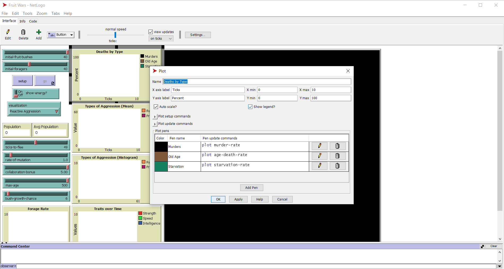
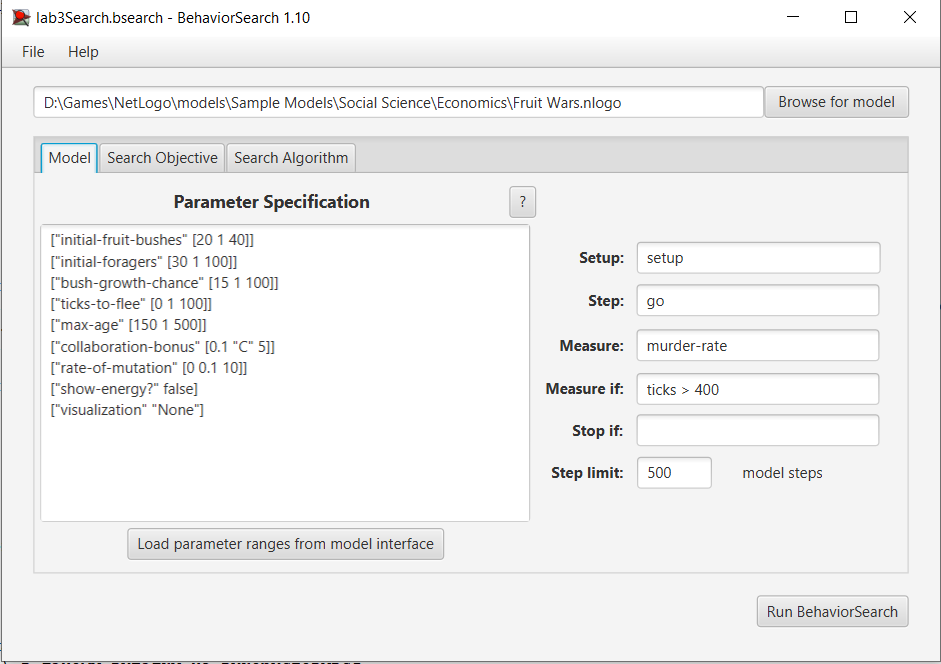
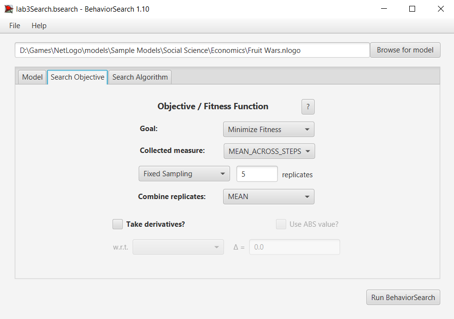
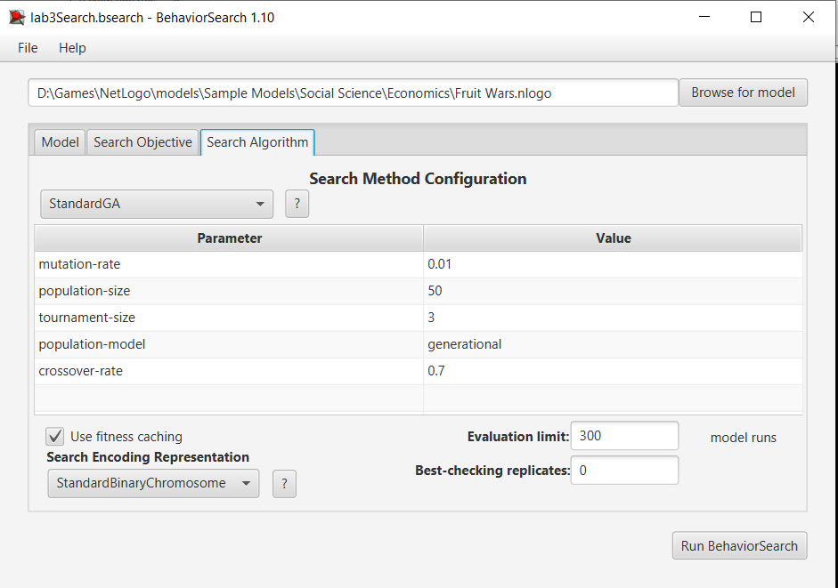
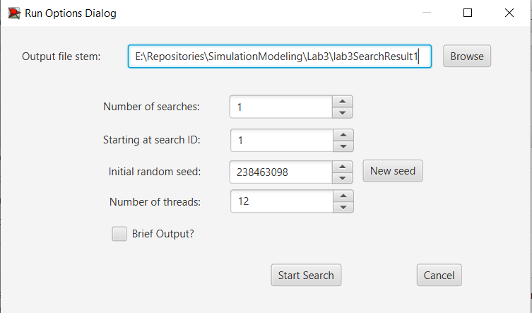
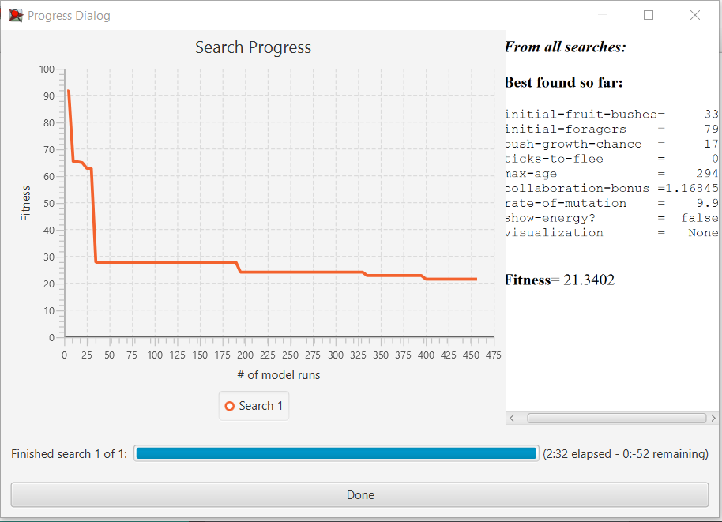
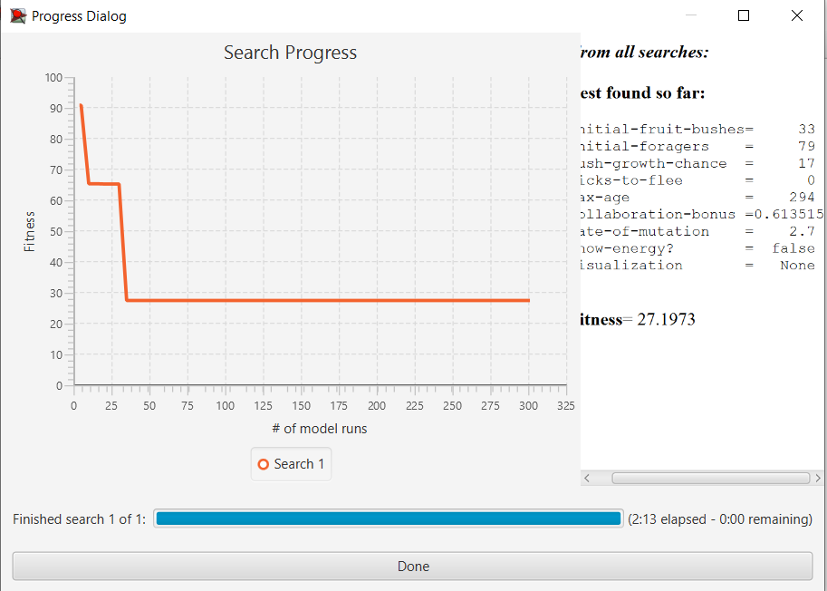

## Імітаційне моделювання комп'ютерних систем
## СПм-21-2, **Скляров Артем Сергійович**
### Лабораторна робота №**3**. Використання засобів обчислювального інтелекту для оптимізації імітаційних моделей

 

### Обрана модель в середовищі NetLogo:
[Fruit Wars](http://www.netlogoweb.org/launch#http://www.netlogoweb.org/assets/modelslib/Sample%20Models/Social%20Science/Economics/Fruit%20Wars.nlogo)

 

### Вербальний опис моделі:
Доступно у файлі з першої лабораторної роботи [Fruit Wars](../Lab1/ІМКС_ЛБ1.md).

### Налаштування середовища BehaviorSearch:

**Обрана модель**:
<pre>
C:\Program Files\NetLogo 6.3.0\models\Sample Models\Social Science\Economics\Fruit Wars.nlogo
</pre>
**Параметри моделі**:  
<pre>
["initial-fruit-bushes" [20 1 40]]
["initial-foragers" [30 1 100]]
["bush-growth-chance" [15 1 100]]
["ticks-to-flee" [0 1 100]]
["max-age" [150 1 500]]
["collaboration-bonus" [0.1 "C" 5]]
["rate-of-mutation" [0 0.1 10]]
["show-energy?" false]
["visualization" "None"]
</pre>
Параметри та їхні передбачувані діапазони були автоматично вилучені середовищем BehaviorSearch з обраної імітаційної моделі.
Для параметрів initial-fruit-bushes, initial-foragers, bush-growth-chance, max-age було підвищене мінімальне значення діапазону з метою унеможливлення створення симуляції в якій популяція вимирає в перші 500 тактів модельного часу.
Для параметрів show-energy? та visualization обрано значення false та None відповідно тому, що вони не впливають на кінцевий результат.
Використовувана **міра**:
Для фітнес-функції - було обрано значення поточної смертності по причині вбивства, вираз для її розрахунку взято з налаштувань графіка аналізованої імітаційної моделі в середовищі NetLogo.

  
та вказано в параметрі "**Measure**":
<pre>
murder-rate
</pre>
Поточна смертність по причині вбивства повинна враховуватися **в середньому** за період симуляції від 400 до 500 тактів (тому що після 400 такту система переходить в сталий стан).
Параметр "**Mesure if**" має вираз:
<pre>
ticks > 400
</pre>
Параметри "**Setup**" та "**Step**" залишаються із значеннями за замовчуванням, тобто "**Setup**" и "**Go**" відповідно.  
Параметр зупинки за умовою ("**Stop if**") в даному випадку не використовувся.
Загальний вигляд вкладки налаштувань параметрів:

**Налаштування цільової функції** (Search Objective):
Метою підбору параметрів імітаційної моделі є **мінімізація** значення поточної смертності по причині вбивства - це вказано через параметр "**Goal**" із значенням **Minimize Fitness**. Тобто потрібно знайти такі параметри налаштувань моделі, при яких смертність буде найменшою. При цьому цікавить не просто смертність в якийсь окремий момент симуляції, а її середнє значення за період симуляції з 400 по 500 такт. Для цього в параметрі "**Collected measure**", що визначає облік значень обраного показника, вказано **MEAN_ACROSS_STEPS**. Щоб уникнути спотворення результатів через випадкові значення, що використовуються в логіці самої імітаційної моделі, **кожна симуляція повторюється по 5 разів**, результуюче значення розраховується як **середнє арифметичне**.
Загальний вигляд вкладки налаштувань цільової функції:  

**Налаштування алгоритму пошуку** (Search Algorithm):
В ході дослідження на лабораторній роботі використовуються два алгоритма: Випадковий пошук (**RandomSearch**) та Простий генетичний алгоритм (**StandardGA**).
Генетичний алгоритм має такі параметри:
<pre>
mutation-rate : 0.01
population-size : 50
tournament-size : 3
population-model : generational
crossover-rate : 0.7
</pre>
Параметр "**Use fitness caching**" має значення true.
Параметр "**Evaluation limit**" має значення 300.
Параметр "**Search Space Encoding Representation**" має значення **StandardBinaryChromosome**.
Загальний вигляд вкладки налаштувань алгоритму пошуку:  

 

### Результати використання BehaviorSearch:
Діалогове вікно запуску пошуку (залишене за замовчуванням):

Результат пошуку параметрів імітаційної моделі, використовуючи **генетичний алгоритм**:

Результат пошуку параметрів імітаційної моделі, використовуючи **випадковий пошук**:
